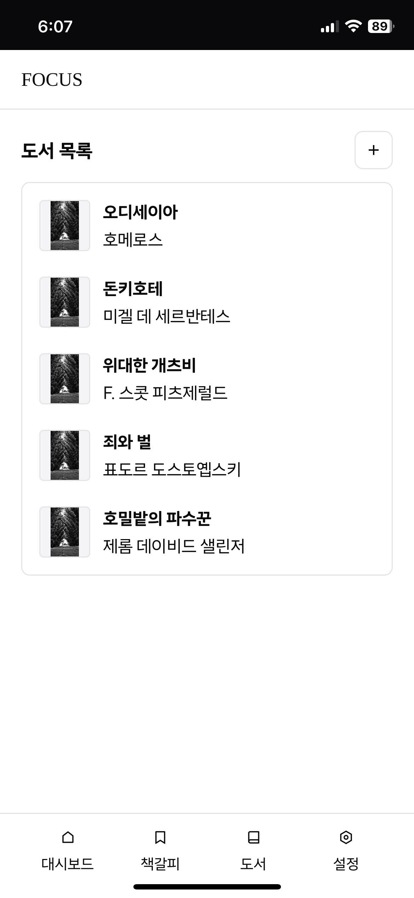

# FOCUS

[FE 리포지토리](https://github.com/radiantbeing/focus-client) | [BE 리포지토리](https://github.com/Win-9/Focus)

> 향상된 독서 경험을 위한 전자 책갈피 웹 애플리케이션


## 개요

- 사용자는 자신이 읽고 있는 도서를 관리하고 책갈피를 추가할 수 있습니다.
- 모바일 중심 UI 설계와 PWA 지원을 통해 모바일 환경에서의 즐거운 사용 경험을 제공합니다.
- FOCUS는 AI를 활용하여 사용자의 독서 경험을 더욱 즐겁게 만듭니다. 최근 읽은 페이지의 자동 요약 기능을 제공할 예정입니다.

## 시작하기

1. 리포지토리를 복제합니다.
   ```bash
   git clone https://github.com/radiantbeing/focus-client.git
   cd focus-client
   ```
2. 의존성을 설치합니다.
   ```bash
   npm install
   ```
3. 개발 서버를 실행합니다.
   ```bash
   npm run dev:host
   ```

## 사용 예시

|  |  |  |
| -------------------------------------------------- | --------------------------------------------------- | --------------------------------------------------- |
